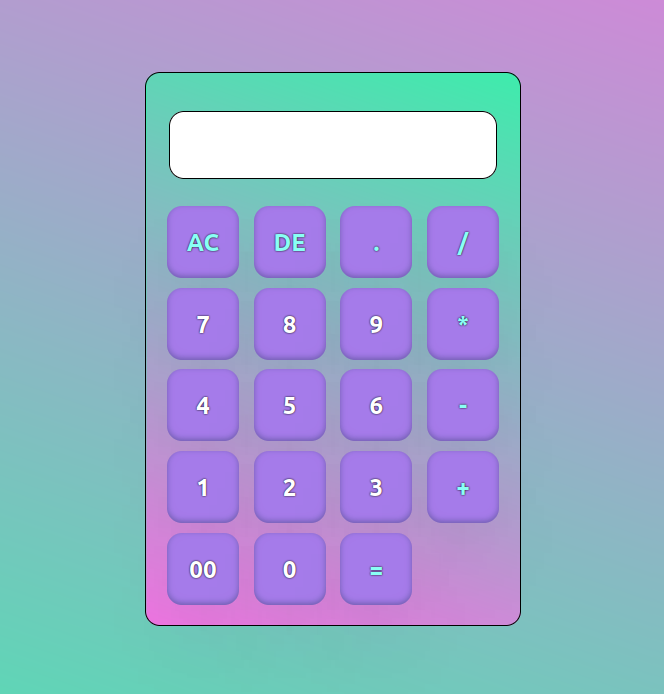

# Calculator

## Description

Petite calculatrice très modeste mais quand même sympa.

## Table des Matières

- [Installation](#installation)
- [Utilisation](#utilisation)
- [Capture d'écran](#capture-décran)
- [Contacts](#contacts)

## Installation

1. Clonez ce dépôt.
2. C'est tout :)

## Utilisation

- Ouvrir le fichier index.html avec votre navigateur préféré.

## Capture d'écran

## Contacts

- Auteur : [Kassim Pavard](https://github.com/Kassim-Pavard)
- Email : kassim_782@yahoo.fr